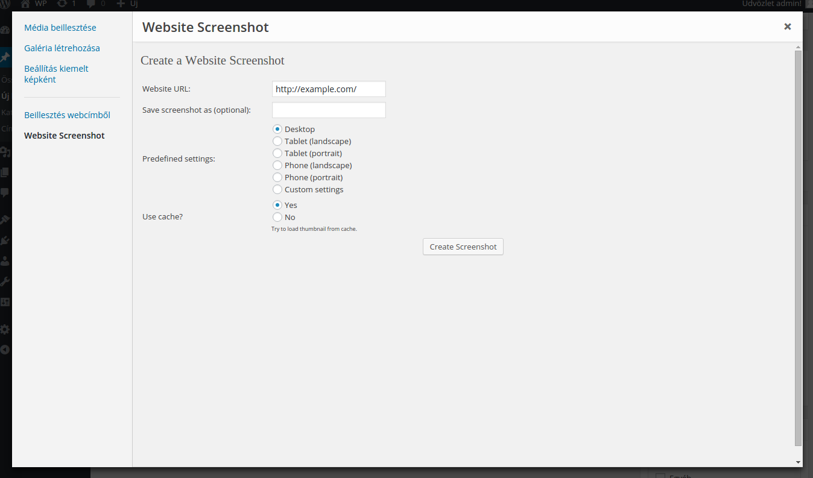
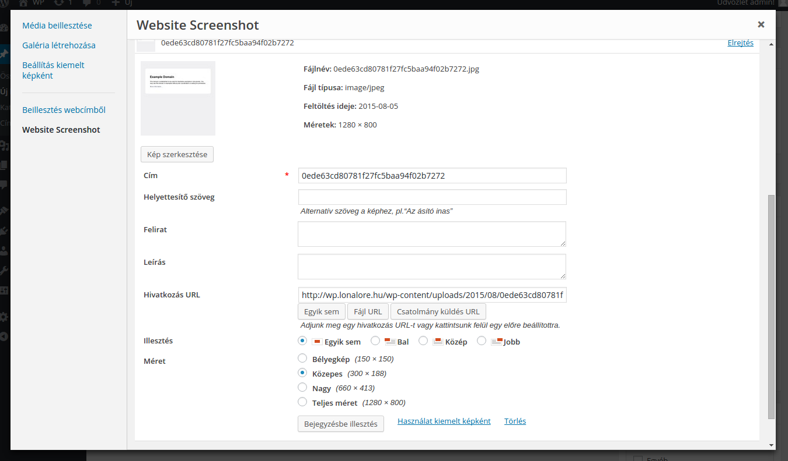

CMP - CaptureMyPage
===================

This plugin creates a website screenshot using only a website URL and save into your own wordpress media library.

### Description

This plugin creates a website screenshot using only a website URL and save into your own wordpress media library.

After creating the image, wordpress will prompt you either to "insert into post" or "change attributes" just like after you upload an image. Renaming is available.

### Installation

- Simpy install from your wordpress plugin page and activate it.
- Get your Service Key by signing up at: http://capturemypage.com
- Set your Service Key for plugin at the "CMP Settings" page on admin area.
- Open your media library and select "Website Screenshot" menu option.

### Donate with [PayPal](https://www.paypal.com/cgi-bin/webscr?cmd=_s-xclick&hosted_button_id=PQYDBAMQ3D2UG)

If you think this plugin is useful and saves you a lot of work, a lot of costs (PHP developers are expensive) and let you sleep much better, then donating a small amount would be very cool.

Screenshots
===========

### Just put in the URL and click "Create Screenshot".

### The image is saved to your media library. You may customize the image and insert to your post.

